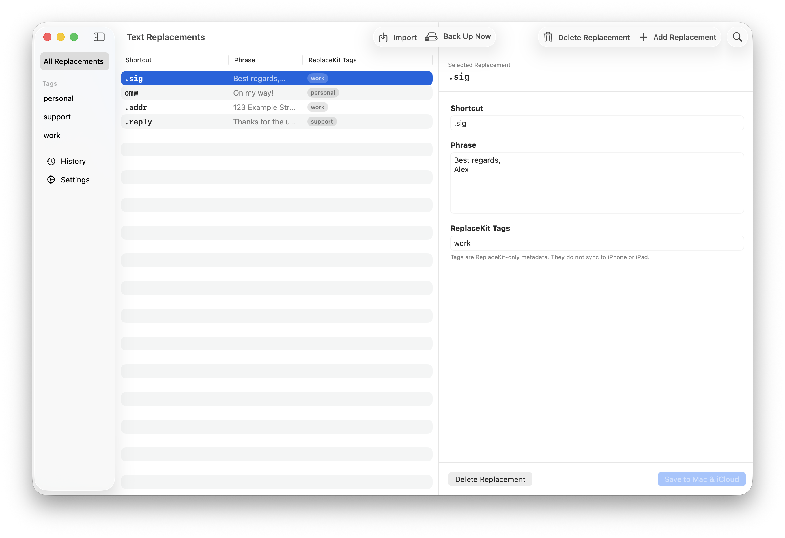
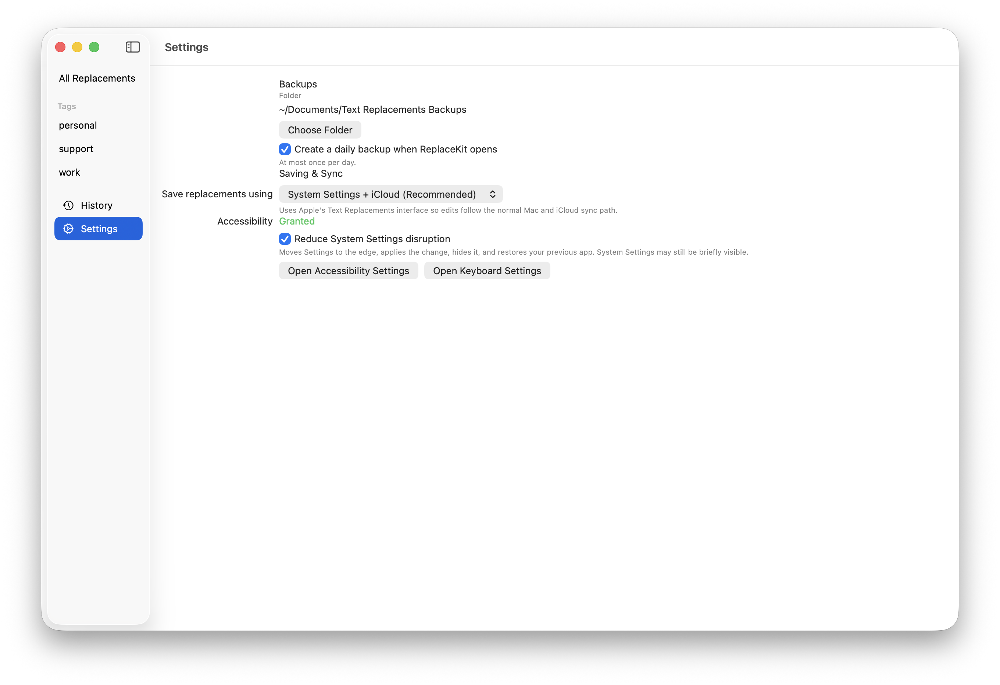

# ReplaceKit

<p align="center">
  
</p>

ReplaceKit is a native macOS utility for managing Apple’s built-in Text
Replacements without replacing Apple’s storage or iCloud sync path.

It gives you a searchable editor, local tags, versioned backups, guarded import
and restore, and a safer workflow for changes that would otherwise require
manually dragging plist files in and out of System Settings.

Requires macOS 14 or newer.

## What It Does

- Search and edit your current macOS Text Replacements.
- Add lightweight ReplaceKit-only tags for organization.
- Create plist snapshots before changes.
- Browse backup history and preview restores before applying them.
- Import Apple-compatible plist files with a diff review.
- Fall back to Apple’s documented drag-in plist workflow when automation fails.
- Keep iPhone and iPad sync on Apple’s normal iCloud Text Replacements path.

## Screenshots

The screenshots below are captured from the real app with dummy replacement data.





## Download

Download the latest `ReplaceKit-macOS.zip` from
[GitHub Releases](../../releases/latest), unzip it, and move
`ReplaceKit.app` to `/Applications`.

The current app bundle is ad-hoc signed and not notarized with Apple Developer
ID. On first launch, macOS may require one of these steps:

1. Right-click `ReplaceKit.app` and choose **Open**.
2. Or open System Settings > Privacy & Security and allow the app.

After first launch:

1. Choose a writable backup folder.
2. Keep the default write mode if you want normal Apple/iCloud sync.
3. Grant Accessibility permission when ReplaceKit asks.

## Privacy

ReplaceKit is a local Mac app. It does not use a server, analytics, telemetry,
or cloud account of its own. Your replacement plist snapshots and ReplaceKit tag
metadata are stored in the backup folder you choose.

Apple’s Text Replacements and iCloud sync remain handled by macOS and iCloud.

## Why Accessibility Is Needed

Apple does not publish an API for writing Text Replacements. ReplaceKit’s safe
mode drives Apple’s own System Settings UI through macOS Accessibility so
Apple’s interface remains the writer of system data.

This is the reliable path for changes that should sync to iPhone and iPad
through Apple’s existing iCloud Text Replacements behavior.

## Write Modes

ReplaceKit has two write modes.

**Safe: System Settings + iCloud** is the recommended default. It opens Apple’s
Keyboard settings page and applies edits through the visible Text Replacements
UI. Quiet apply is enabled by default: ReplaceKit moves Settings to the edge,
applies the edit, hides Settings, and restores your previous app.

**Experimental: Silent Local Write** writes
`NSUserDictionaryReplacementItems` in the macOS global defaults domain directly.
It does not open System Settings and does not need Accessibility permission, but
Apple does not document this as a supported write API. Treat it as local-only;
it does not reliably publish changes into Apple’s iCloud TextInput sync path.

Both modes create a pre-change snapshot before editing unless you explicitly
apply once without snapshot protection.

## Backups And Tags

ReplaceKit stores ordinary files in your chosen backup folder:

```text
Text Replacements Backups/
  snapshots/
    2026-06-02T14-30-00Z.plist
    2026-06-02T14-30-00Z.metadata.json
  replacekit.json
```

The plist files contain Apple replacement records. JSON files contain
ReplaceKit metadata such as tags and backup reasons.

Tags are ReplaceKit-only metadata. They do not appear in Apple’s plist format
and do not sync to iPhone or iPad.

## Manual Fallback

If System Settings automation cannot finish, ReplaceKit generates an
Apple-compatible `property list.plist` and reveals it in Finder. You can then
open System Settings > Keyboard > Text Input > Text Replacements and drag the
plist into the list.

Apple documents this backup and restore workflow in
[Back up and share text replacements on Mac](https://support.apple.com/guide/mac-help/mchl2a7bd795/mac).

## Build From Source

ReplaceKit builds with Apple’s Command Line Tools:

```bash
swift run ReplaceKitTests
swift build
Scripts/package-app.sh
open outputs/ReplaceKit.app
```

`Scripts/package-app.sh` creates a Finder-launchable app at
`outputs/ReplaceKit.app`.

For local development, the script automatically uses a local
`ReplaceKit Local Code Signing` identity when one is available. This preserves
macOS Accessibility approval across rebuilds. Set
`REPLACEKIT_CODESIGN_IDENTITY="-"` to force ad-hoc signing.

## Create A Release Zip

Build and package the app, then zip the bundle without flattening it:

```bash
Scripts/package-app.sh
COPYFILE_DISABLE=1 ditto -c -k --norsrc --keepParent outputs/ReplaceKit.app outputs/ReplaceKit-macOS.zip
```

Upload `outputs/ReplaceKit-macOS.zip` as a GitHub Release asset.

## Diagnostic Probe

Inspect the current System Settings Accessibility tree:

```bash
swift run ReplaceKitAXProbe
```

Run a disposable add, update, and delete smoke test through System Settings:

```bash
swift run ReplaceKitAXProbe --smoke-write
```

Run the same smoke test with quiet presentation:

```bash
swift run ReplaceKitAXProbe --smoke-write --quiet
```

## Compatibility Boundary

ReplaceKit intentionally avoids private framework writes as its default path.
It reads the observed `NSUserDictionaryReplacementItems` global preference to
refresh the editor, but safe writes go through Apple’s Settings UI.

If Apple changes the System Settings Text Replacements interface, ReplaceKit may
need an update. Existing snapshots remain Apple-compatible plist files.

## License

No open-source license has been selected yet.
